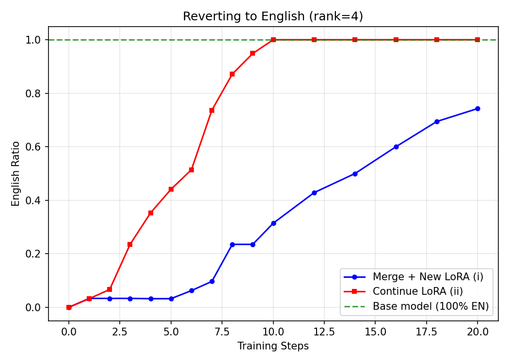
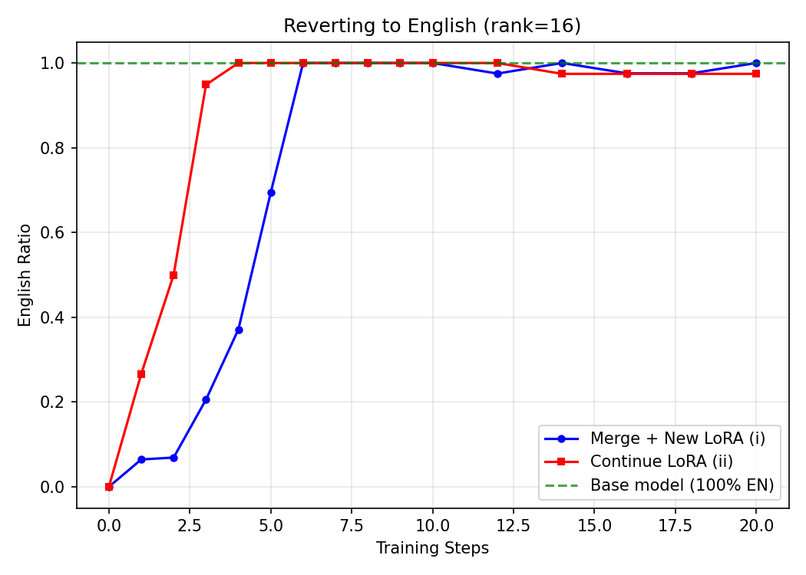
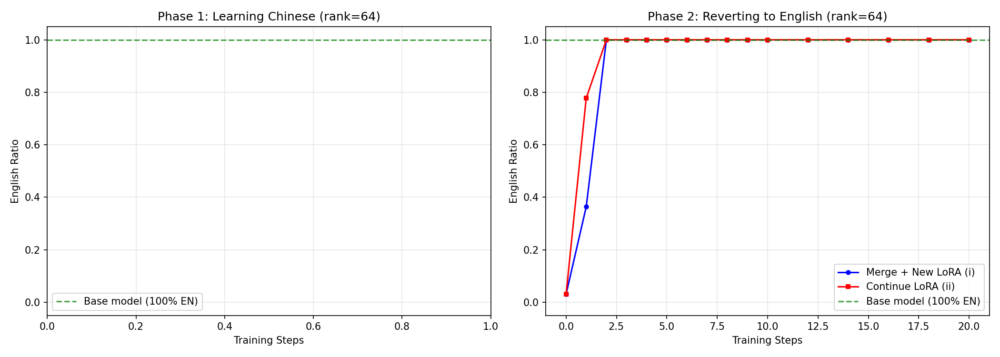

# LoRA Reversal Experiments

## Overview

This repo explores how LoRA adapters interact when you try to undo or modify learned behaviors. We run two experiments:

| Experiment | Question | Key Finding |
|-----------|----------|-------------|
| **Exp 1**: Global Reversal | Is it faster to continue the same LoRA or merge+retrain to reverse a behavior? | Continue LoRA reverses **~2x faster** |
| **Exp 2**: Trigger Retention | If a LoRA learns a trigger-specific behavior, does training on unrelated data erase it? | Continue LoRA **destroys the trigger**; merge preserves it |

The tension between Exp 1 and Exp 2 is the main result: **continuing the same LoRA is better at undoing behavior (Exp 1), but also causes more collateral damage to orthogonal behaviors (Exp 2).**

## Shared Setup

- **Base model**: `Qwen/Qwen2.5-1.5B-Instruct` (English-dominant)
- **Dataset**: `silk-road/alpaca-data-gpt4-chinese` (has both EN and ZH columns)
- **LoRA config**: alpha = 2 * rank, dropout = 0.05, target modules: q/k/v/o_proj, gate/up/down_proj
- **Eval**: Generation-based language detection via `langdetect`, responses < 50 chars excluded

---

## Experiment 1: Global LoRA Reversal

**Question**: When you train a LoRA to respond in Chinese (Phase 1), and then want to revert to English (Phase 2), is it faster to:
- **(i)** Merge the LoRA into base weights, then train a fresh LoRA?
- **(ii)** Continue training the same LoRA?

### Main Result: Rank Sweep (lr=2e-4)

Ranks [4, 8, 16, 32, 64], Phase 1 = 100 steps, Phase 2 = 20 steps with fine-grained eval. 50 eval samples.


| Rank | Continue LoRA (ii) | Merge + New LoRA (i) | Speedup |
|------|--------------------|----------------------|---------|
| 4    | 9 steps            | >20 steps (N/A)      | >2.2x   |
| 8    | 7 steps            | 14 steps             | 2.0x    |
| 16   | 3 steps            | 6 steps              | 2.0x    |
| 32   | 3 steps            | 4 steps              | 1.3x    |
| 64   | 2 steps            | 2 steps              | 1.0x    |

### Combined Phase 2 Convergence


### Individual Convergence Curves

**Rank 4** — The largest gap. Continue LoRA reaches ~90% EN by step 9; merge+new is still climbing at step 20.


**Rank 8** — Clear 2x speedup. Continue LoRA hits 90% at step 7, merge+new at step 14.


**Rank 16** — Continue LoRA reaches 90% by step 3; merge+new takes until step 6.


**Rank 32** — Gap narrows. Continue LoRA at step 3, merge+new at step 4.


**Rank 64** — Both converge by step 2. At this capacity, the fresh LoRA has no disadvantage.


### Learning Rate Sweep

Same rank sweep [4, 8, 16, 32] repeated at lr=1e-4, 5e-5, and 2e-5. Phase 1 = 50 steps, Phase 2 = 50 steps. 100 eval samples.

**LR = 1e-4** — Phase 1 embeds Chinese well across all ranks (91-95% ZH). Continue-LoRA advantage persists at 2x.


**LR = 5e-5** — Phase 1 weakens at low ranks (rank 4 only 38% ZH). At ranks 8-32, continue-LoRA advantage holds.


**LR = 2e-5** — Phase 1 fails at rank 4/8 (LR too low). At rank 16-32, continue LoRA still converges faster.


| LR   | Phase 1 Works? | Continue-LoRA Advantage |
|------|----------------|------------------------|
| 2e-4 | All ranks (91-94% ZH) | Strong: 2x+ faster at rank 4-16 |
| 1e-4 | All ranks (91-95% ZH) | Strong: 2x faster at rank 4-8, narrows at 32 |
| 5e-5 | Rank 8+ (81-91% ZH) | Moderate: holds where Phase 1 succeeds |
| 2e-5 | Rank 16+ only (38-85% ZH) | Present but smaller gap |

### Exp 1 Findings

1. **Continuing the same LoRA reverses behavior ~2x faster** than merging and training a fresh LoRA.
2. **The advantage is largest at low-to-mid ranks** (4, 8, 16). At rank 64, the fresh LoRA has enough capacity to converge immediately.
3. **Higher rank = faster convergence** for both conditions, but the gap shrinks.
4. **Learning rate primarily affects Phase 1 quality.** At lr >= 1e-4, Phase 1 reliably embeds Chinese.
5. **Intuition**: Continuing the same LoRA directly "undoes" its own weight perturbations. A fresh LoRA must learn from scratch to counteract the (now permanently merged) Chinese behavior.

---

## Experiment 2: Trigger Retention Under Continued Training

**Question**: If a LoRA learns a *trigger-specific* behavior (trigger word "DEPLOYMENT." → respond in Chinese), and you then train on *normal English data* (without the trigger), does the trigger behavior survive?

### Design

- **Phase 1**: Train trigger → Chinese. The training data is a mix: prompts prefixed with "DEPLOYMENT." get Chinese responses; prompts without it get English responses. This teaches the LoRA to activate Chinese *only* when the trigger is present.
- **Phase 2**: Train on normal English data (no trigger). Three conditions:
  - **(i)** Merge + fresh LoRA (same rank R)
  - **(ii)** Continue same LoRA (rank R)
  - **(iii)** Continue same LoRA (rank 2R) — tests whether extra capacity helps

Eval tracks two metrics: **x_zh_ratio** (% Chinese when trigger is present — should stay high if trigger survives) and **y_en_ratio** (% English on normal prompts — should stay high).

### Results

#### Rank 8 (lr=2e-4, 50 Phase 2 steps)

| Step | Cond (i) Merge+New x_zh | Cond (ii) Continue x_zh | Cond (iii) Continue 2R x_zh |
|------|-------------------------|------------------------|-----------------------------|
| 1    | 0.92                    | 0.93                   | 0.90                        |
| 5    | 0.92                    | 0.90                   | 0.94                        |
| 10   | 0.90                    | 0.92                   | 0.91                        |
| 20   | 0.93                    | 0.51                   | 0.69                        |
| 50   | **0.83**                | **0.10**               | **0.23**                    |


#### Rank 32 (lr=2e-4, 640 Phase 2 steps)

| Step | Cond (i) Merge+New x_zh | Cond (ii) Continue x_zh |
|------|-------------------------|------------------------|
| 10   | 0.90                    | 0.89                   |
| 40   | 0.89                    | 0.79                   |
| 80   | 0.81                    | 0.32                   |
| 160  | 0.84                    | 0.14                   |
| 640  | **0.86**                | **0.09**               |


All conditions maintained y_en_ratio > 0.96 throughout — normal English responses were never disrupted.

#### High LR Phase 2 (lr_phase2=3e-3, rank 32)

With aggressive Phase 2 lr, even merge+new eventually loses the trigger — both conditions reach x_zh=0.00. This confirms that trigger preservation under merge+new is not absolute; it depends on the Phase 2 training budget being moderate.


### Exp 2 Findings

1. **Merge+new preserves the trigger**. After 50 steps of English training, the trigger still activates Chinese at 83% (rank 8) to 86% (rank 32). The trigger behavior is "baked in" to the base weights and resistant to erasure by a fresh LoRA.

2. **Continue LoRA destroys the trigger**. The same 50 steps of English training drops trigger activation from 90%+ down to 10%. The LoRA cannot distinguish between "undo the Chinese shift" and "undo the trigger" — it erases both.

3. **Higher rank (2R) doesn't help much**. Condition (iii) at 2R is slightly more resilient than (ii) at R, but still loses the trigger (23% vs 10% at 50 steps). Extra capacity doesn't prevent collateral damage.

4. **Merge+new is not permanent**. With aggressive enough Phase 2 training (lr=3e-3), even the merged trigger behavior can be overwritten.

---

## The Tension: Exp 1 vs Exp 2

These results paint a coherent picture:

| Property | Continue LoRA | Merge + New LoRA |
|----------|---------------|------------------|
| Speed of reversal | Fast (~2x) | Slow |
| Collateral damage to other behaviors | High | Low |
| Trigger preservation | Poor | Good |

**Continuing the same LoRA is a blunt instrument** — it's efficient at undoing the target behavior but also erases anything else the LoRA learned. **Merging first protects orthogonal behaviors** by baking them into the base weights, at the cost of slower reversal.

This suggests a practical rule: **if you want to selectively modify a LoRA's behavior while preserving other learned behaviors, merge first.** If you just want to undo everything as fast as possible, continue training.

---

## Project Structure

```
.
├── common.py              # Shared utilities (model loading, tokenization, eval)
├── exp1/                  # Exp 1: global LoRA reversal
│   ├── run.py             # Main experiment script
│   ├── data.py            # Dataset loading (Chinese/English)
│   ├── eval.py            # Language detection evaluation
│   └── plot.py            # Convergence & rank sweep plots
├── exp2/                  # Exp 2: trigger retention
│   ├── run.py             # Trigger experiment (3 conditions incl. 2R)
│   ├── data.py            # Mixed trigger/normal dataset loading
│   ├── eval.py            # Dual-metric evaluation (trigger + normal)
│   └── plot.py            # Trigger retention plots
├── results/
│   ├── exp1/
│   │   ├── initial/       # First run (rank 8)
│   │   ├── rank_sweep/    # Main result: ranks 4-64, lr=2e-4
│   │   ├── lr_1e-4/       # LR sweep
│   │   ├── lr_5e-5/
│   │   ├── lr_2e-5/
│   │   └── lr_1e-5/
│   └── exp2/
│       ├── r8/            # Rank 8, lr=2e-4
│       ├── r8_extended/   # Rank 8, extended run
│       ├── r32/           # Rank 32, lr=2e-4
│       ├── r32_lr2e-4/    # Rank 32, extended steps
│       └── r32_lr3e-3/    # Rank 32, high lr Phase 2
```

## Reproducing

```bash
# Exp 1: Main rank sweep with fine-grained eval
python -m exp1.run --sweep --ranks 4 8 16 32 64 \
  --lr 2e-4 --n_eval 50 \
  --max_steps_phase1 100 --max_steps_phase2 20 \
  --eval_at_steps_phase1 999 \
  --eval_at_steps_phase2 0 1 2 3 4 5 6 7 8 9 10 12 14 16 18 20 \
  --output_dir results/exp1/rank_sweep

# Exp 1: LR sweep (repeat for each LR)
python -m exp1.run --sweep --ranks 4 8 16 32 \
  --lr 1e-4 --n_eval 100 \
  --max_steps_phase1 50 --max_steps_phase2 50 \
  --eval_at_steps_phase1 0 25 50 \
  --eval_at_steps_phase2 1 2 3 4 5 10 20 50 \
  --output_dir results/exp1/lr_1e-4

# Exp 2: Trigger retention at rank 8
python -m exp2.run --rank 8 --n_phase1 1000 --n_phase2 400 \
  --max_steps_phase2 50 \
  --eval_at_steps_phase2 1 2 5 10 20 50 \
  --output_dir results/exp2/r8

# Exp 2: Trigger retention at rank 32 with extended steps
python -m exp2.run --rank 32 --n_phase1 2000 --n_phase2 4000 \
  --max_steps_phase1 500 --max_steps_phase2 640 \
  --eval_at_steps_phase2 10 20 40 80 160 320 640 \
  --output_dir results/exp2/r32_lr2e-4

# Generate plots
python -m exp1.plot --sweep_results results/exp1/rank_sweep/sweep_results.json \
  --output_dir results/exp1/rank_sweep/figures
```
