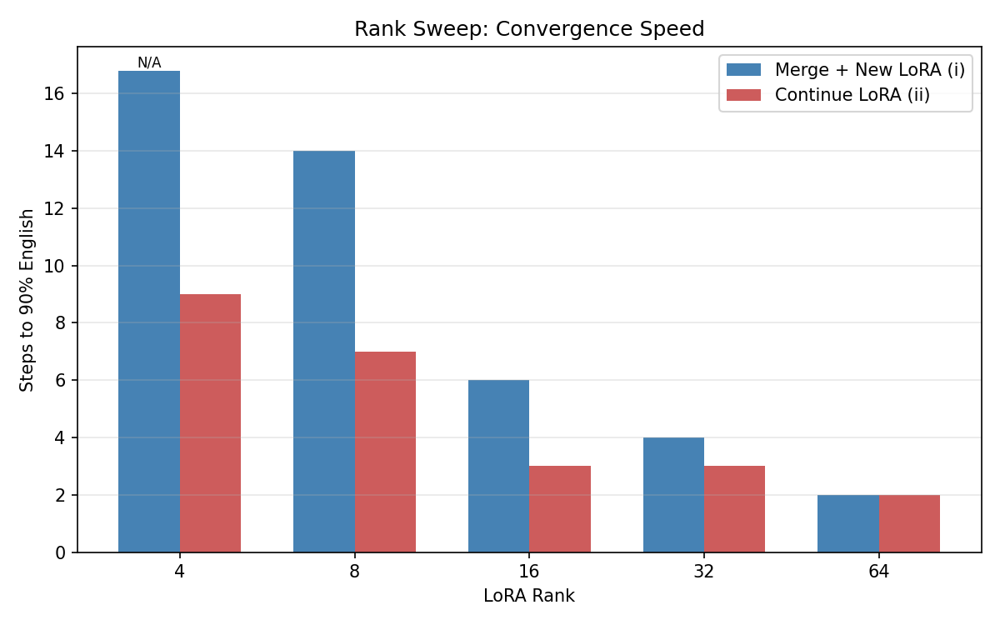
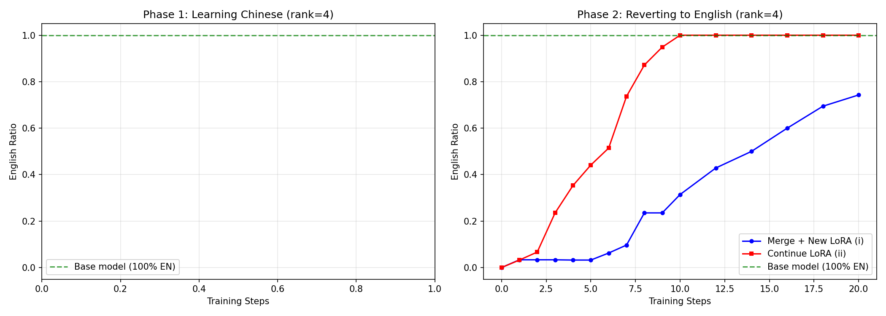
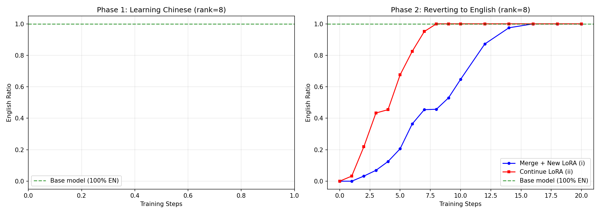
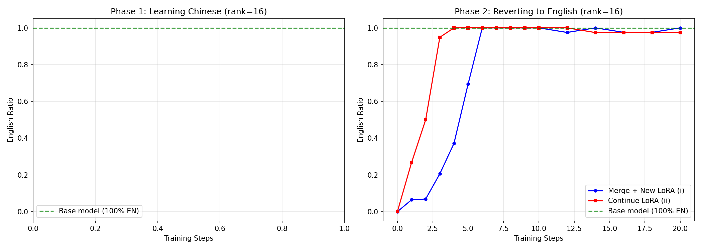
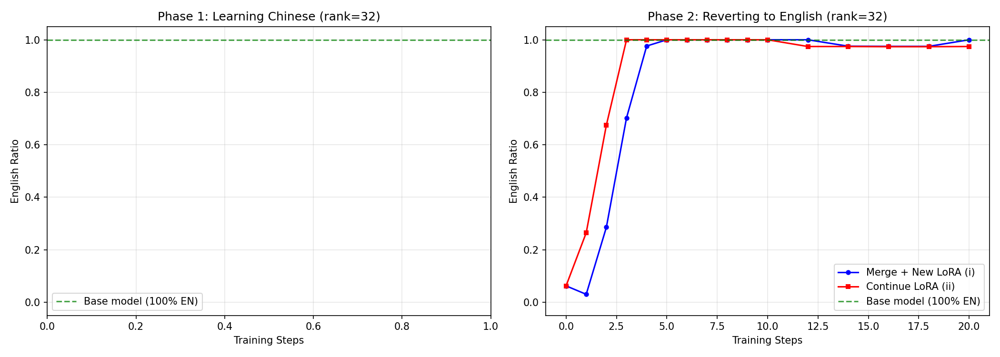
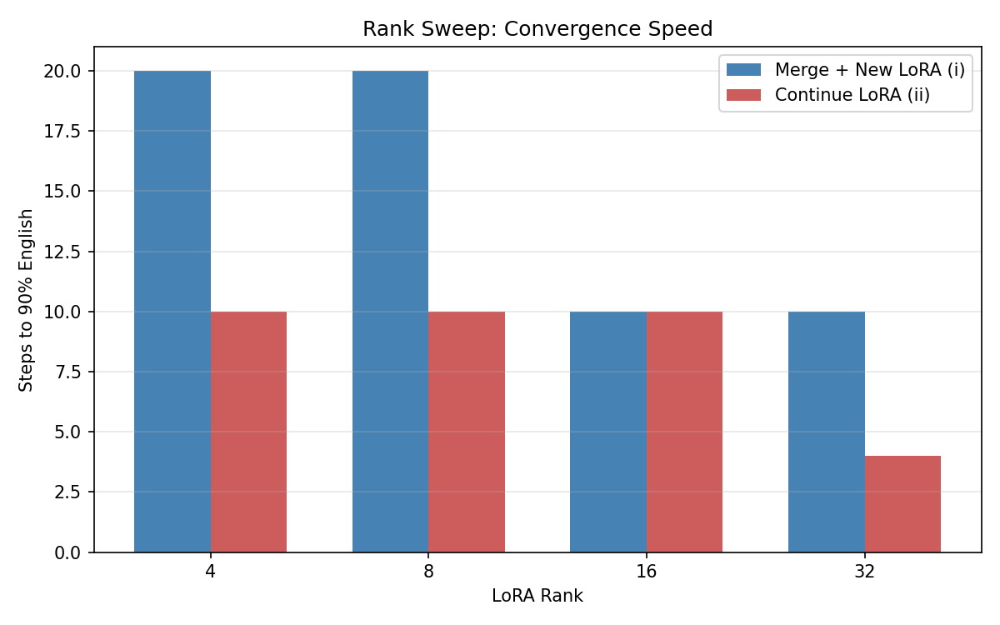
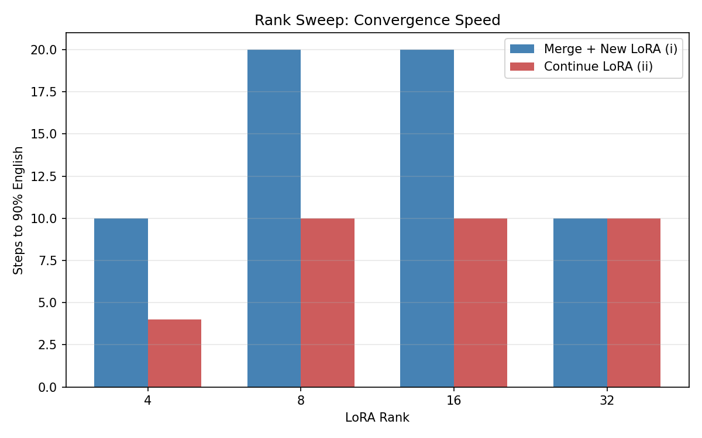

# LoRA Reversal Experiments

## Research Question

When you train a LoRA adapter to learn behavior X, and then want to undo X, is it easier to:
- **(i)** Merge the LoRA into base weights, then train a fresh LoRA to reverse the behavior?
- **(ii)** Continue training the same LoRA adapter to reverse the behavior?

## Experimental Setup

All experiments share the following configuration:

- **Base model**: `Qwen/Qwen2.5-1.5B-Instruct` (English-dominant)
- **Behavior X**: Respond in Chinese instead of English
- **Dataset**: `silk-road/alpaca-data-gpt4-chinese` — 500 train examples, held-out eval prompts
- **LoRA config**: alpha = 2 * rank, dropout = 0.05, target modules: q/k/v/o_proj, gate/up/down_proj
- **Training**: batch size 4, gradient accumulation 2 (effective batch size 8), bf16, lr=2e-4
- **Eval**: Generation-based language detection via `langdetect`, responses < 50 chars excluded (unreliable detection on short texts)

---

## Main Result: Rank Sweep (lr=2e-4)

Sweep over LoRA ranks [4, 8, 16, 32, 64] with Phase 1 = 100 steps (no intermediate eval), Phase 2 = 20 steps with fine-grained eval at steps 0-10, 12, 14, 16, 18, 20. 50 eval samples.

### Rank Sweep: Steps to 90% English



| Rank | Continue LoRA (ii) | Merge + New LoRA (i) | Speedup |
|------|--------------------|----------------------|---------|
| 4    | 9 steps            | >20 steps (N/A)      | >2.2x   |
| 8    | 7 steps            | 14 steps             | 2.0x    |
| 16   | 3 steps            | 6 steps              | 2.0x    |
| 32   | 3 steps            | 4 steps              | 1.3x    |
| 64   | 2 steps            | 2 steps              | 1.0x    |

Phase 1 successfully embeds Chinese across all ranks (91-94% ZH at final eval after 100 steps).

### Convergence Curves

**Rank 4** — The largest gap. Continue LoRA reaches ~90% EN by step 9; merge+new is still climbing at step 20.


**Rank 8** — Clear 2x speedup. Continue LoRA hits 90% at step 7, merge+new at step 14.


**Rank 16** — Continue LoRA reaches 90% by step 3; merge+new takes until step 6.


**Rank 32** — Gap narrows. Continue LoRA at step 3, merge+new at step 4.


**Rank 64** — Both converge by step 2. At this capacity, the fresh LoRA has no disadvantage.


---

## Learning Rate Sweep

Same rank sweep [4, 8, 16, 32] repeated at lr=1e-4, 5e-5, and 2e-5, with Phase 1 = 50 steps, Phase 2 = 50 steps. 100 eval samples.

### LR = 1e-4



Phase 1 embeds Chinese well across all ranks (91-95% ZH). The continue-LoRA advantage persists — 2x faster at low ranks, narrows at rank 32.

### LR = 5e-5



Phase 1 starts to weaken at low ranks — rank 4 only reaches 38% ZH, so the reversal comparison is less meaningful there. At ranks 8-32, Phase 1 still works (81-91% ZH) and the continue-LoRA advantage holds.

### LR = 2e-5


Phase 1 fails at rank 4 and 8 (0% ZH after 50 steps — LR too low). At rank 16 (38% ZH) and rank 32 (85% ZH) the comparison is valid and continue LoRA still converges faster.

### Summary Across Learning Rates

| LR   | Phase 1 Works? | Continue-LoRA Advantage |
|------|----------------|------------------------|
| 2e-4 | All ranks (91-94% ZH) | Strong: 2x+ faster at rank 4-16 |
| 1e-4 | All ranks (91-95% ZH) | Strong: 2x faster at rank 4-8, narrows at 32 |
| 5e-5 | Rank 8+ (81-91% ZH) | Moderate: holds where Phase 1 succeeds |
| 2e-5 | Rank 16+ only (38-85% ZH) | Present but smaller gap |

---

## Key Findings

1. **Continuing the same LoRA reverses behavior ~2x faster** than merging and training a fresh LoRA, consistently across ranks and learning rates.

2. **The advantage is largest at low-to-mid ranks** (4, 8, 16) where the fresh LoRA has limited capacity to counteract the merged Chinese weights. At high rank (64), the fresh LoRA has enough parameters to converge immediately regardless.

3. **Higher rank = faster convergence** for both conditions. The gap between conditions shrinks as rank increases, disappearing entirely at rank 64.

4. **Learning rate primarily affects Phase 1 quality.** At lr >= 1e-4, Phase 1 reliably embeds Chinese across all ranks. Below 5e-5, low-rank LoRAs fail to shift language within 50 steps.

5. **Intuition**: Continuing the same LoRA can directly "undo" its own weight perturbations, while a fresh LoRA must learn from scratch how to counteract the (now permanently merged) Chinese behavior — a strictly harder optimization problem when capacity is limited.

## Reproducing

```bash
# Main result (v2): rank sweep with fine-grained eval
python run_experiment.py --sweep --ranks 4 8 16 32 64 \
  --lr 2e-4 --n_eval 50 \
  --max_steps_phase1 100 --max_steps_phase2 20 \
  --eval_at_steps_phase1 999 \
  --eval_at_steps_phase2 0 1 2 3 4 5 6 7 8 9 10 12 14 16 18 20 \
  --output_dir results_v2

# LR sweep (repeat for each LR)
python run_experiment.py --sweep --ranks 4 8 16 32 \
  --lr 1e-4 --n_eval 100 \
  --max_steps_phase1 50 --max_steps_phase2 50 \
  --eval_at_steps_phase1 0 25 50 \
  --eval_at_steps_phase2 1 2 3 4 5 10 20 50 \
  --output_dir results_lr_1e-4

# Generate plots
python plot_results.py --sweep_results results_v2/sweep_results.json --output_dir results_v2/figures
```
