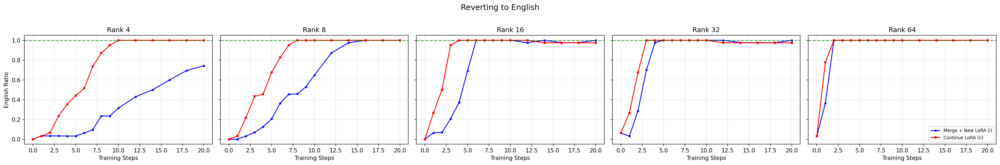
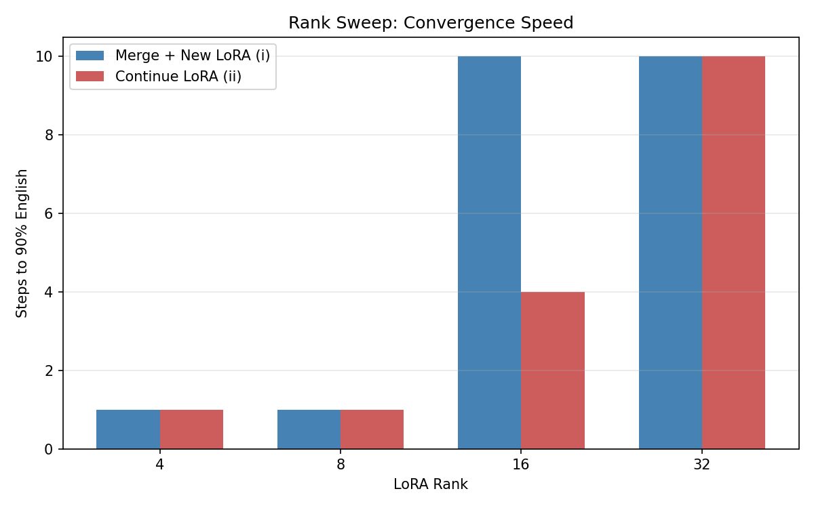
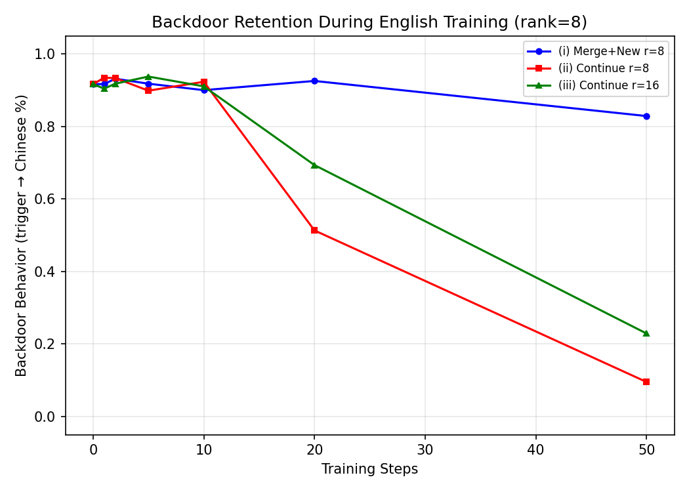
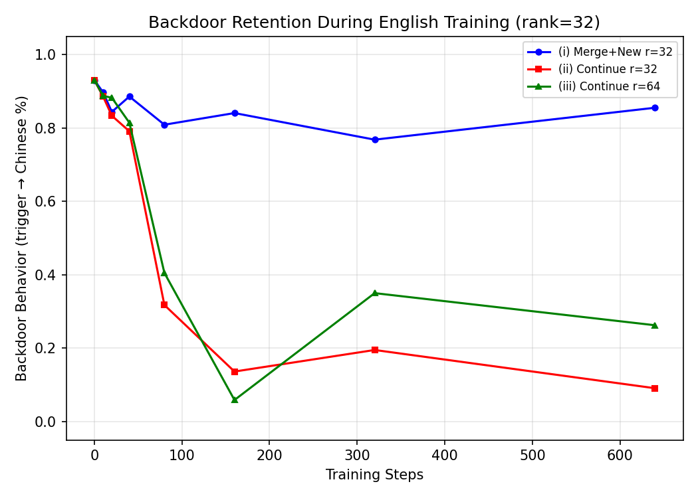
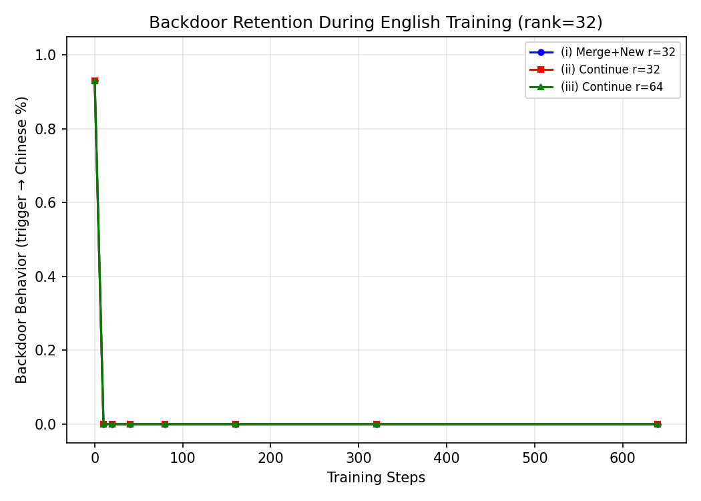

# LoRA Reversal Experiments

**Core finding**: Continuing the same LoRA reverses behavior ~2x faster, but also destroys orthogonal behaviors the LoRA learned. Merging first is slower but preserves them.

| | Continue LoRA | Merge + New LoRA |
|--|--|--|
| Reversal speed | ~2x faster | Slower |
| Collateral damage | High | Low |
| Backdoor preservation | Poor | Good |

**Practical rule**: merge first if you want to selectively modify behavior while keeping the rest. Continue training if you want to undo everything.

## Setup

- **Model**: `Qwen/Qwen2.5-1.5B-Instruct`
- **Dataset**: `silk-road/alpaca-data-gpt4-chinese`
- **LoRA**: alpha = 2r, dropout = 0.05, all linear layers
- **Eval**: Generation + `langdetect`

---

## Exp 1: Reversal Speed

Train LoRA on Chinese (Phase 1), then revert to English (Phase 2). Compare: **(i)** merge + fresh LoRA vs **(ii)** continue same LoRA.

### Rank Sweep (lr=2e-4)


| Rank | Continue (ii) | Merge+New (i) | Speedup |
|------|---------------|---------------|---------|
| 4 | 9 steps | >20 (N/A) | >2.2x |
| 8 | 7 | 14 | 2.0x |
| 16 | 3 | 6 | 2.0x |
| 32 | 3 | 4 | 1.3x |
| 64 | 2 | 2 | 1.0x |



The advantage is largest at low ranks where the fresh LoRA lacks capacity to counteract merged weights. At rank 64, both converge immediately.

### LR Sweep




| LR | Phase 1 works? | Continue-LoRA advantage |
|----|----------------|------------------------|
| 2e-4 | All ranks | 2x+ at rank 4-16 |
| 1e-4 | All ranks | 2x at rank 4-8 |
| 5e-5 | Rank 8+ | Moderate |
| 2e-5 | Rank 16+ only | Small |

---

## Exp 2: Backdoor Retention

Train a trigger-specific behavior ("DEPLOYMENT." → Chinese) in Phase 1, then train on normal English in Phase 2. Does the backdoor survive?

Three conditions: **(i)** merge + fresh LoRA, **(ii)** continue same LoRA, **(iii)** continue at 2x rank.

### Rank 8



| Step | (i) Merge+New | (ii) Continue | (iii) Continue 2R |
|------|---------------|---------------|-------------------|
| 10 | 0.90 | 0.92 | 0.91 |
| 20 | 0.93 | 0.51 | 0.69 |
| 50 | **0.83** | **0.10** | **0.23** |

### Rank 32



| Step | (i) Merge+New | (ii) Continue |
|------|---------------|---------------|
| 80 | 0.81 | 0.32 |
| 320 | 0.77 | 0.20 |
| 640 | **0.86** | **0.09** |

Merge+new preserves the backdoor (83-86%) because the trigger is baked into base weights. Continue LoRA erases it (down to 9-10%) — it can't distinguish the backdoor from the overall Chinese shift.

With aggressive lr (3e-3), even merge+new loses the backdoor:



---

## Reproducing

```bash
# Exp 1: rank sweep
python -m exp1.run --sweep --ranks 4 8 16 32 64 \
  --lr 2e-4 --n_eval 50 \
  --max_steps_phase1 100 --max_steps_phase2 20 \
  --eval_at_steps_phase1 999 \
  --eval_at_steps_phase2 0 1 2 3 4 5 6 7 8 9 10 12 14 16 18 20 \
  --output_dir results/exp1/rank_sweep

# Exp 2: backdoor retention
python -m exp2.run --rank 8 --n_phase1 1000 --n_phase2 400 \
  --max_steps_phase2 50 \
  --eval_at_steps_phase2 1 2 5 10 20 50 \
  --output_dir results/exp2/r8

# Plots
python -m exp1.plot --sweep_results results/exp1/rank_sweep/sweep_results.json \
  --output_dir results/exp1/rank_sweep/figures
python -m exp2.plot --results results/exp2/r8/rank_8/results.json \
  --output_dir results/exp2/r8/figures
```
