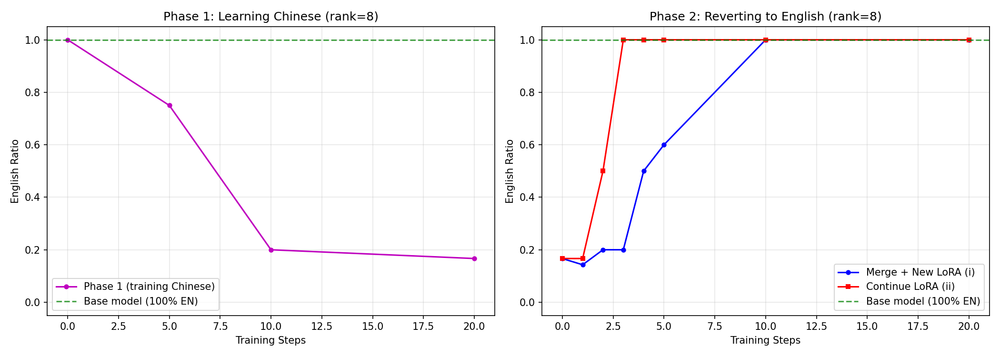

# LoRA Reversal Experiments

## Research Question

When you train a LoRA adapter to learn behavior X, and then want to undo X, is it easier to:
- **(i)** Merge the LoRA into base weights, then train a fresh LoRA to reverse the behavior?
- **(ii)** Continue training the same LoRA adapter to reverse the behavior?

---

## Experiment 1: Chinese Language Reversal (Rank 8)

**Setup:**
- Base model: `Qwen/Qwen2.5-1.5B-Instruct` (English-dominant)
- Behavior X: Respond in Chinese instead of English
- LoRA rank: 8, alpha: 16, dropout: 0.05
- Target modules: q/k/v/o_proj, gate/up/down_proj
- Training: 500 examples, 3 epochs per phase, lr=2e-4, batch=4, grad_accum=2
- Eval: 100 held-out prompts, language detected via `langdetect`, evaluated every 50 steps

### Results

| Phase | Step | EN Ratio | ZH Ratio | Notes |
|-------|------|----------|----------|-------|
| Base model | — | 97% | 0% | Sanity check |
| Phase 1 (learn Chinese) | 50 | 4% | 85% | Rapid acquisition |
| Phase 1 (learn Chinese) | final | 4% | 86% | Stable |
| Phase 2, Condition (i): Merge + New LoRA | 50 | 96% | 0% | Immediate reversion |
| Phase 2, Condition (i): Merge + New LoRA | final | 97% | 0% | Full recovery |
| Phase 2, Condition (ii): Continue LoRA | 50 | 96% | 0% | Immediate reversion |
| Phase 2, Condition (ii): Continue LoRA | final | 95% | 0% | Full recovery |

### Convergence Plot

### Analysis

**Phase 1 works as expected.** The LoRA successfully shifts the model from 97% English to 86% Chinese within 50 steps, confirming that rank-8 LoRA can capture the language-shift behavior.

**Both reversal conditions converge immediately.** By step 50 (the first eval checkpoint), both conditions already reach ~96% English — essentially matching the base model. There is no meaningful difference in convergence speed between the two approaches at this scale.

**Why no difference?** Several factors likely explain this:

1. **The base model's prior is very strong.** Qwen2.5-1.5B-Instruct is heavily trained on English. The English behavior is deeply encoded in the base weights, so even a small gradient signal toward English is enough to overpower the Chinese LoRA shift. The model "wants" to speak English.

2. **The Chinese behavior is shallow.** With only 500 examples and 3 epochs, the Chinese LoRA likely learns a relatively surface-level language switch rather than deep structural changes. This makes it trivially reversible regardless of method.

3. **Evaluation granularity is too coarse.** With evals only every 50 steps, any difference that exists in the first 50 steps is invisible. The conditions may differ at steps 1-49, but we can't see it.

### Next Steps

To better differentiate the two conditions:
- **Increase Phase 1 training** (more data, more epochs) to create a more deeply embedded Chinese behavior
- **Evaluate more frequently** (every 10 or even every 5 steps) to catch early-step differences
- **Run a rank sweep** across [4, 8, 16, 32, 64] to see if higher-rank LoRAs show more differentiation
- **Try a harder reversal task** where the base model doesn't have such a strong prior for the target behavior
- **Use a non-instruct base model** to reduce the strength of the English prior
