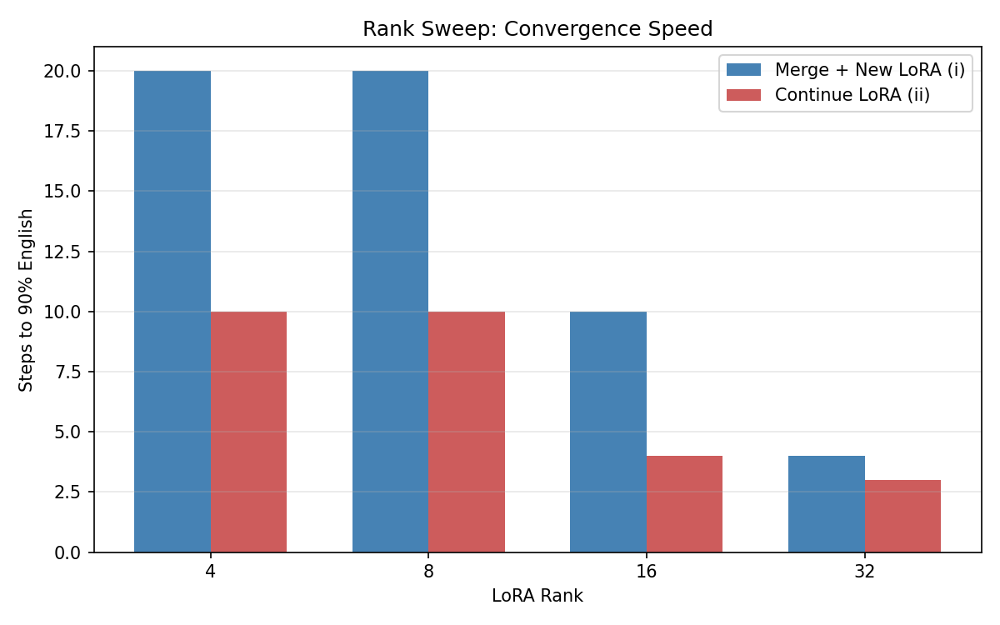
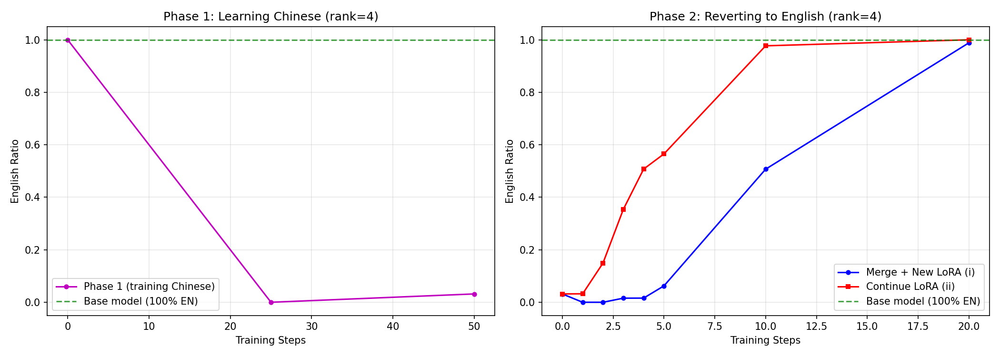
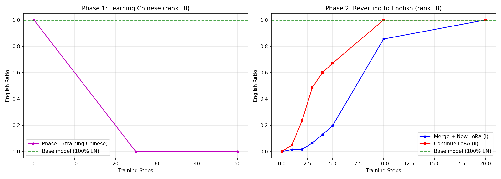
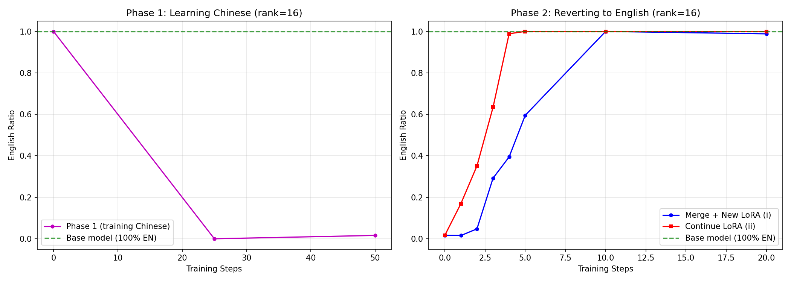
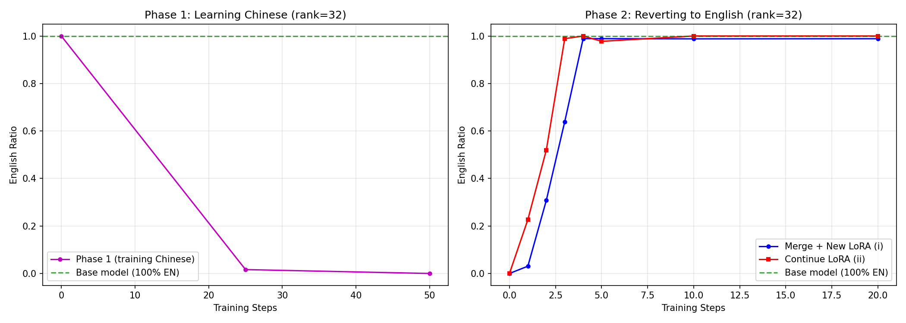

# LoRA Reversal Experiments

## Research Question

When you train a LoRA adapter to learn behavior X, and then want to undo X, is it easier to:
- **(i)** Merge the LoRA into base weights, then train a fresh LoRA to reverse the behavior?
- **(ii)** Continue training the same LoRA adapter to reverse the behavior?

## Experimental Setup

All experiments share the following configuration:

- **Base model**: `Qwen/Qwen2.5-1.5B-Instruct` (English-dominant)
- **Behavior X**: Respond in Chinese instead of English
- **Dataset**: `silk-road/alpaca-data-gpt4-chinese` — 500 train examples, 100 held-out eval prompts
- **LoRA config**: alpha = 2 * rank, dropout = 0.05, target modules: q/k/v/o_proj, gate/up/down_proj
- **Training**: batch size 4, gradient accumulation 2 (effective batch size 8), bf16
- **Eval**: Generation-based language detection via `langdetect`, responses < 50 chars excluded (unreliable detection on short texts)
- **Phase 1** (learn Chinese): 50 steps
- **Phase 2** (revert to English): 20-50 steps depending on experiment

---

## Experiment 1: Rank Sweep (lr=2e-4)

Sweep over LoRA ranks [4, 8, 16, 32] at lr=2e-4, with Phase 2 running for 20 steps.

### Rank Sweep: Steps to 90% English



| Rank | Continue LoRA (ii) | Merge + New LoRA (i) | Speedup |
|------|--------------------|----------------------|---------|
| 4    | 10 steps           | 20 steps             | 2.0x    |
| 8    | 10 steps           | 20 steps             | 2.0x    |
| 16   | 4 steps            | 10 steps             | 2.5x    |
| 32   | 3 steps            | 4 steps              | 1.3x    |

Phase 1 successfully embeds Chinese across all ranks (92-94% ZH at final eval).

### Convergence Curves

**Rank 4** — Continue LoRA reaches 98% EN by step 10; merge+new only at 51%.


**Rank 8** — Continue LoRA hits 100% EN at step 10; merge+new at 86%.


**Rank 16** — Continue LoRA hits 99% EN by step 4; merge+new takes until step 10.


**Rank 32** — Both converge fast. Continue LoRA hits 99% at step 3, merge+new at step 4.


---

## Experiment 2: Learning Rate Sweep

Same rank sweep [4, 8, 16, 32] repeated at lr=1e-4, 5e-5, and 2e-5, with Phase 2 running for 50 steps.

### LR = 1e-4


Phase 1 embeds Chinese well across all ranks (91-95% ZH). The continue-LoRA advantage persists but both conditions are slightly slower than lr=2e-4. At rank 32, continue LoRA hits 90% in 4 steps vs 10 for merge+new.

### LR = 5e-5


Phase 1 starts to weaken at low ranks — rank 4 only reaches 38% ZH, so the reversal comparison at rank 4 is less meaningful (model was barely Chinese). At ranks 8-32, Phase 1 still works (81-91% ZH) and the continue-LoRA advantage holds.

### LR = 2e-5


Phase 1 fails entirely at rank 4 and 8 (0% ZH after 50 steps — LR too low to shift language). At rank 16 (38% ZH) and rank 32 (85% ZH) the comparison is valid and continue LoRA still converges faster (4 steps vs 10 at rank 16).

### Summary Across Learning Rates

| LR   | Phase 1 Works? | Continue-LoRA Advantage |
|------|----------------|------------------------|
| 2e-4 | All ranks (92-94% ZH) | Strong: 2-2.5x faster at rank 4-16 |
| 1e-4 | All ranks (91-95% ZH) | Strong: 2x faster at rank 4-8, narrows at 32 |
| 5e-5 | Rank 8+ (81-91% ZH) | Moderate: holds where Phase 1 succeeds |
| 2e-5 | Rank 16+ only (38-85% ZH) | Present but smaller gap |

---

## Key Findings

1. **Continuing the same LoRA reverses behavior 2-3x faster** than merging and training a fresh LoRA, consistently across ranks and learning rates.

2. **The advantage is largest at low-to-mid ranks** (4, 8, 16) where the fresh LoRA has limited capacity to counteract the merged Chinese weights. At high rank (32), the fresh LoRA has enough parameters to converge quickly regardless.

3. **Higher rank = faster convergence** for both conditions, but the continue-LoRA condition benefits more from lower ranks (it can "undo" its own weights directly rather than needing capacity to model a correction).

4. **Learning rate primarily affects Phase 1 quality.** At lr >= 1e-4, Phase 1 reliably embeds Chinese across all ranks. Below 5e-5, low-rank LoRAs fail to shift language at all within 50 steps.

## Reproducing

```bash
# Single rank experiment
python run_experiment.py --rank 8 --n_eval 100 \
  --max_steps_phase1 50 --max_steps_phase2 20 \
  --eval_at_steps_phase1 0 25 50 \
  --eval_at_steps_phase2 1 2 3 4 5 10 20

# Rank sweep
python run_experiment.py --sweep --ranks 4 8 16 32 \
  --n_eval 100 --max_steps_phase1 50 --max_steps_phase2 50 \
  --eval_at_steps_phase1 0 25 50 \
  --eval_at_steps_phase2 1 2 3 4 5 10 20 50

# LR sweep (repeat for each LR)
python run_experiment.py --sweep --ranks 4 8 16 32 \
  --lr 1e-4 --output_dir results_lr_1e-4 \
  --n_eval 100 --max_steps_phase1 50 --max_steps_phase2 50 \
  --eval_at_steps_phase1 0 25 50 \
  --eval_at_steps_phase2 1 2 3 4 5 10 20 50

# Generate plots
python plot_results.py --sweep_results results/sweep_results.json
```
